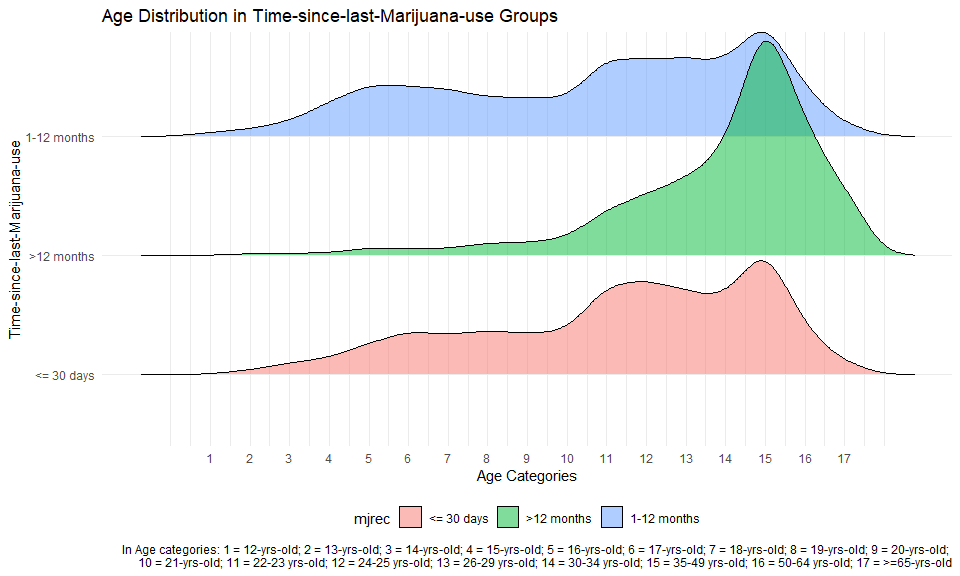

Graph_Alice
================
Tianyou Wang
2022-11-29

## Data Malnipulation

``` r
nsduh_df = read_csv("data/nsduh_19.csv")
```

    ## Rows: 56136 Columns: 14
    ## ── Column specification ────────────────────────────────────────────────────────
    ## Delimiter: ","
    ## dbl (14): questid2, age2, mr30est, catag6, newrace2, irmjage, mjrec, mrjmon,...
    ## 
    ## ℹ Use `spec()` to retrieve the full column specification for this data.
    ## ℹ Specify the column types or set `show_col_types = FALSE` to quiet this message.

``` r
mari_df = nsduh_df %>%
  filter(mjrec == c("1", "2", "3")) %>%
  mutate(mjrec = recode(mjrec, "1" = "<= 30 days",
                        "2" = "1-12 months",
                        "3" = ">12 months")) %>%
  group_by(mjrec)
```

## density_ridges graph

``` r
mari_df %>% 
  ggplot(aes(x = age2, y = mjrec, fill = mjrec)) + 
  geom_density_ridges(alpha = 0.5) +
  labs(title = "Age Distribution in Time-since-last-Marijuana-use Groups",
       x = "Age Categories",
       y = "Time-since-last-Marijuana-use",
       caption = "In Age categories: 1 = 12-yrs-old; 2 = 13-yrs-old; 3 = 14-yrs-old; 4 = 15-yrs-old; 5 = 16-yrs-old; 6 = 17-yrs-old; 7 = 18-yrs-old; 8 = 19-yrs-old; 9 = 20-yrs-old; \n10 = 21-yrs-old; 11 = 22-23 yrs-old; 12 = 24-25 yrs-old; 13 = 26-29 yrs-old; 14 = 30-34 yrs-old; 15 = 35-49 yrs-old; 16 = 50-64 yrs-old; 17 = >=65-yrs-old") +
  scale_x_continuous(breaks = c(1,2,3,4,5,6,7,8,9,10,11,12,13,14,15,16,17))
```

    ## Picking joint bandwidth of 0.583



## histograms.

``` r
mari_df %>% 
  ggplot(aes(x = age2, fill = mjrec)) +
  geom_histogram(position = "dodge") +
  labs(title = "Age Distribution in Time-since-last-Marijuana-use Groups",
       x = "Age Categories",
       y = "Time-since-last-Marijuana-use",
       caption = "In Age categories: 1 = 12-yrs-old; 2 = 13-yrs-old; 3 = 14-yrs-old; 4 = 15-yrs-old; 5 = 16-yrs-old; 6 = 17-yrs-old; 7 = 18-yrs-old; 8 = 19-yrs-old; 9 = 20-yrs-old; \n10 = 21-yrs-old; 11 = 22-23 yrs-old; 12 = 24-25 yrs-old; 13 = 26-29 yrs-old; 14 = 30-34 yrs-old; 15 = 35-49 yrs-old; 16 = 50-64 yrs-old; 17 = >=65-yrs-old") +
  scale_x_continuous(breaks = c(1,2,3,4,5,6,7,8,9,10,11,12,13,14,15,16,17))
```

    ## `stat_bin()` using `bins = 30`. Pick better value with `binwidth`.


