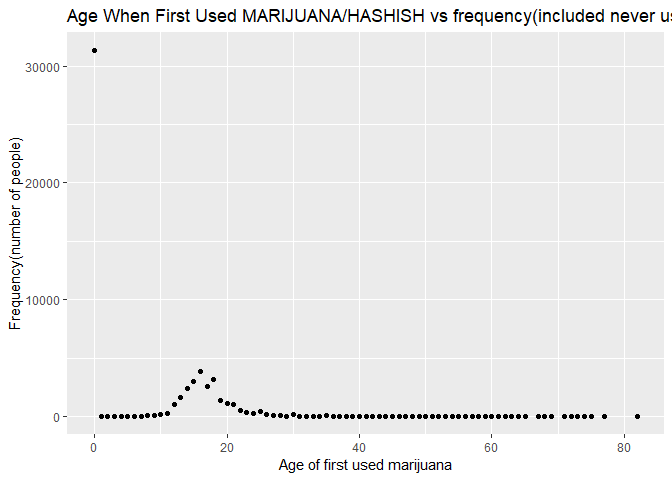

Graph_Joyce
================
Qiaoyi Xu
2022-11-27

``` r
library(tidyverse)
```

``` r
info_scatter = read_csv("data/nsduh_19.csv")
```

    ## Rows: 56136 Columns: 15
    ## ── Column specification ──────────────────────────────────────────────────────────────────────
    ## Delimiter: ","
    ## dbl (15): questid2, age2, mr30est, catag6, newrace2, irmjage, mjrec, mrjmon,...
    ## 
    ## ℹ Use `spec()` to retrieve the full column specification for this data.
    ## ℹ Specify the column types or set `show_col_types = FALSE` to quiet this message.

``` r
info_scatter
```

    ## # A tibble: 56,136 × 15
    ##    quest…¹  age2 mr30est catag6 newra…² irmjage mjrec mrjmon ymdeyr amdeyr irsex
    ##      <dbl> <dbl>   <dbl>  <dbl>   <dbl>   <dbl> <dbl>  <dbl>  <dbl>  <dbl> <dbl>
    ##  1  4.33e7    15      93      4       1      21     3      0     NA      1     1
    ##  2  6.51e7    17      91      6       5     991    91      0     NA      2     2
    ##  3  4.94e7    14      93      3       1      20     3      0     NA      2     1
    ##  4  5.10e7     9      91      2       1     991    91      0     NA      2     2
    ##  5  3.18e7     7      91      2       1     991    91      0     NA      2     1
    ##  6  8.70e7    16      99      5       2      14     1      1     NA      1     1
    ##  7  6.56e7     8      93      2       1      17     2      0     NA      2     2
    ##  8  4.54e7    17      91      6       1     991    91      0     NA      2     1
    ##  9  1.52e7    14      91      3       5     991    91      0     NA      2     2
    ## 10  7.60e7    15      91      4       2     991    91      0     NA      2     2
    ## # … with 56,126 more rows, 4 more variables: eduhighcat <dbl>, income <dbl>,
    ## #   irmarit <dbl>, coutyp4 <dbl>, and abbreviated variable names ¹​questid2,
    ## #   ²​newrace2

In this part, we created a scatter plot to show the age when first used
MARIJUANA/HASHISH and frequency of people in each year. We excluded
people who never use MARIJUANA/HASHISH in this plot. Because, without
doubts, most people never use MARIJUANA/HASHISH. In our dataset, there
are 31340 people who never use MARIJUANA/HASHISH. Therefore, after
excluded poeple who never use MARIJUANA/HASHISH, it is more clear to see
the distribution of Age when First Used among people who used
MARIJUANA/HASHISH.

``` r
info_scatterplot = info_scatter %>%
  filter(irmjage!=991)%>%
  group_by(irmjage) %>%
  summarise(number_people = n()) %>%
  ggplot(aes (x = irmjage, y = number_people)) +
  geom_point() +
  geom_smooth() +
  labs(x = "Age of first used marijuana", y = "Frequency(number of people)",
       title = "Age When First Used among people who used MARIJUANA/HASHISH")
  

info_scatterplot                                 
```

    ## `geom_smooth()` using method = 'loess' and formula = 'y ~ x'

<!-- -->

From this plot, we could conclude that most people who used Marijuan
strarted bwtween 10 and 30 years old when first used marijuana. So, it
is necessary to focus on youth population during our further steps.

``` r
info_scatterplot_addneveruse = info_scatter %>%
  mutate(irmjage = as.character(irmjage),
         irmjage = recode(irmjage, "991" = "0"), #0 = "Never Use"
         irmjage = as.numeric(irmjage))%>%
  group_by(irmjage) %>%
  summarise(number_people = n()) %>%
  ggplot(aes (x = irmjage, y = number_people)) +
  geom_point() +
  theme_grey() +
  labs(x = "Age of first used marijuana", y = "Frequency(number of people)",
       title = "Age When First Used MARIJUANA/HASHISH vs frequency(included never use)")
  

info_scatterplot_addneveruse  
```

<!-- -->

=============================================================================================================================  
not useful code, prepare for future use if need:

mutate(firstuse_age = if_else(irmjage\<12, “Under 12”,
if_else(irmjage\>=12&irmjage\<=18, “12-18”,
if_else(irmjage\>=19&irmjage\<=25, “19-25”,
if_else(irmjage\>=26&irmjage\<=30, “26-30”,
if_else(irmjage\>=31&irmjage\<=40, “31-40”,
if_else(irmjage\>=41&irmjage\<=50, “41-50”,
if_else(irmjage\>=51&irmjage\<=60, “51-60”,
if_else(irmjage\>60&irmjage\<=82, “above 60”, if_else(irmjage == 991,
“Never Use”, NA_character\_))))))))))
