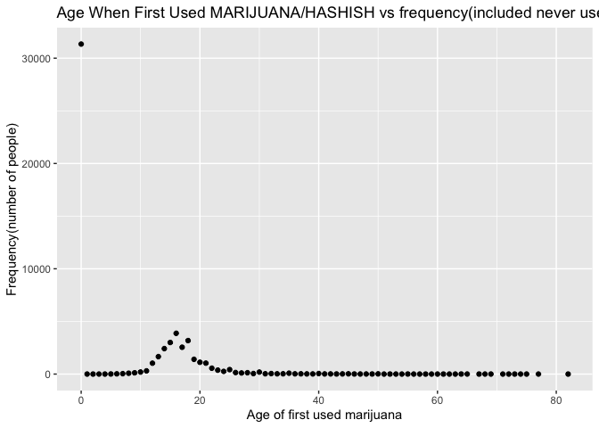

Graph_Joyce
================
Qiaoyi Xu
2022-11-27

``` r
library(tidyverse)
```

    ## ── Attaching packages ─────────────────────────────────────── tidyverse 1.3.2 ──
    ## ✔ ggplot2 3.3.6      ✔ purrr   0.3.4 
    ## ✔ tibble  3.1.8      ✔ dplyr   1.0.10
    ## ✔ tidyr   1.2.0      ✔ stringr 1.4.1 
    ## ✔ readr   2.1.2      ✔ forcats 0.5.2 
    ## ── Conflicts ────────────────────────────────────────── tidyverse_conflicts() ──
    ## ✖ dplyr::filter() masks stats::filter()
    ## ✖ dplyr::lag()    masks stats::lag()

``` r
info_scatter = read_csv("data/nsduh_19.csv")
```

    ## Rows: 56136 Columns: 14
    ## ── Column specification ────────────────────────────────────────────────────────
    ## Delimiter: ","
    ## dbl (14): questid2, age2, mr30est, catag6, newrace2, irmjage, mjrec, mrjmon,...
    ## 
    ## ℹ Use `spec()` to retrieve the full column specification for this data.
    ## ℹ Specify the column types or set `show_col_types = FALSE` to quiet this message.

``` r
info_scatter
```

    ## # A tibble: 56,136 × 14
    ##    quest…¹  age2 mr30est catag6 newra…² irmjage mjrec mrjmon ymdelt amdelt irsex
    ##      <dbl> <dbl>   <dbl>  <dbl>   <dbl>   <dbl> <dbl>  <dbl>  <dbl>  <dbl> <dbl>
    ##  1  4.33e7    15      93      4       1      21     3      0     NA      1     1
    ##  2  6.51e7    17      91      6       5     991    91      0     NA      2     2
    ##  3  4.94e7    14      93      3       1      20     3      0     NA      2     1
    ##  4  5.10e7     9      91      2       1     991    91      0     NA      2     2
    ##  5  3.18e7     7      91      2       1     991    91      0     NA      2     1
    ##  6  8.70e7    16      99      5       2      14     1      1     NA      1     1
    ##  7  6.56e7     8      93      2       1      17     2      0     NA      2     2
    ##  8  4.54e7    17      91      6       1     991    91      0     NA      2     1
    ##  9  1.52e7    14      91      3       5     991    91      0     NA      2     2
    ## 10  7.60e7    15      91      4       2     991    91      0     NA      2     2
    ## # … with 56,126 more rows, 3 more variables: eduhighcat <dbl>, income <dbl>,
    ## #   irmarit <dbl>, and abbreviated variable names ¹​questid2, ²​newrace2

``` r
info_scatterplot = info_scatter %>%
  filter(irmjage!=991)%>%
  group_by(irmjage) %>%
  summarise(number_people = n()) %>%
  ggplot(aes (x = irmjage, y = number_people)) +
  geom_point() +
  labs(x = "Age of first used marijuana", y = "Frequency(number of people)",
       title = "Age When First Used MARIJUANA/HASHISH vs frequency(excluded never use)")
  

info_scatterplot                                 
```

<!-- -->

``` r
info_scatterplot_addneveruse = info_scatter %>%
  mutate(irmjage = as.character(irmjage),
         irmjage = recode(irmjage, "991" = "0"), #0 = "Never Use"
         irmjage = as.numeric(irmjage))%>%
  group_by(irmjage) %>%
  summarise(number_people = n()) %>%
  ggplot(aes (x = irmjage, y = number_people)) +
  geom_point() +
  theme_grey() +
  labs(x = "Age of first used marijuana", y = "Frequency(number of people)",
       title = "Age When First Used MARIJUANA/HASHISH vs frequency(included never use)")
  

info_scatterplot_addneveruse  
```

<!-- -->

not useful code, prepare for future use if need:

mutate(firstuse_age = if_else(irmjage\<12, “Under 12”,
if_else(irmjage\>=12&irmjage\<=18, “12-18”,
if_else(irmjage\>=19&irmjage\<=25, “19-25”,
if_else(irmjage\>=26&irmjage\<=30, “26-30”,
if_else(irmjage\>=31&irmjage\<=40, “31-40”,
if_else(irmjage\>=41&irmjage\<=50, “41-50”,
if_else(irmjage\>=51&irmjage\<=60, “51-60”,
if_else(irmjage\>60&irmjage\<=82, “above 60”, if_else(irmjage == 991,
“Never Use”, NA_character\_))))))))))
